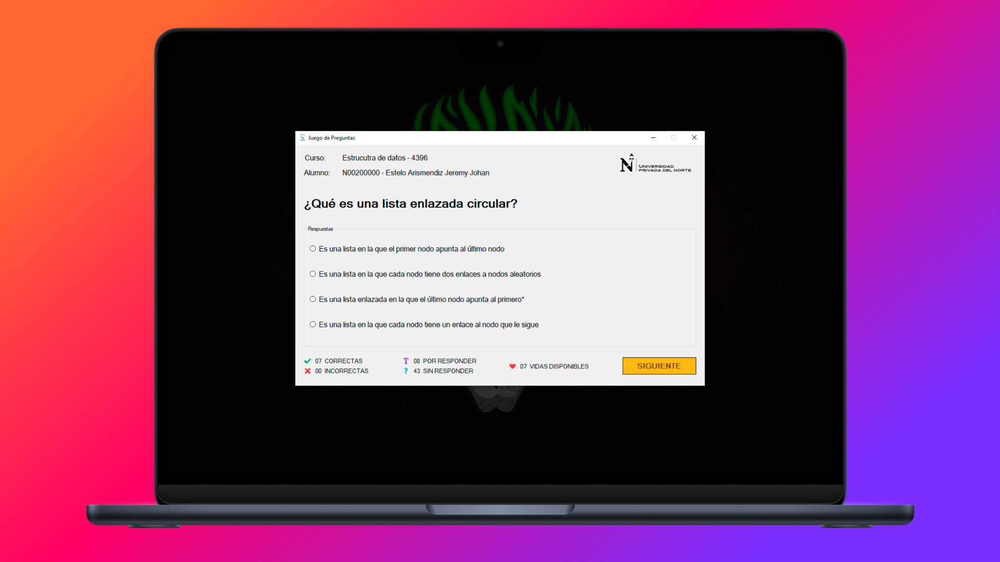

<div align="center">

# QuizGame

Juego de palabras para reforzar lo aprendido del curso de **"ESTRUCTURA DE DATOS"**



</div>

## 📚 Temas

Se realiza preguntas al azar sobre los siguientes temas:

- Árboles Binarios
- Colas
- Listas Enlazadas Circulares
- Listas Enlazadas Dobles
- Listas Enlazadas Simples
- Pilas

## 🧱 Cómo iniciar

1. Clona el repositorio

```bash
git clone https://github.com/SprikerS/QuizGame.git
```

2. Abre el proyecto en Visual Studio
3. Ejecuta el proyecto
4. Juega

## 📦 Carga de Preguntas

- Las preguntas se cargan de forma dinámica desde un archivo JSON, lo cual permite personalizar el contenido fácilmente.
- Para el manejo de JSON se utiliza el paquete NuGet `System.Text.Json`, facilitando la deserialización y manipulación de los datos en el juego.
- Puedes modificar el archivo `questions.json` para agregar o cambiar preguntas según sea necesario.

### Estructura del JSON de Preguntas

Cada pregunta en el archivo `questions.json` sigue la siguiente estructura:

```json
{
    "id": 1,
    "question": "¿Cuál es una ventaja de usar una lista enlazada sobre un array?",
    "answers": [
        "Permite una inserción y eliminación más eficiente de elementos en cualquier posición",
        "Ocupa menos memoria que un array",
        "Proporciona acceso directo a los elementos",
        "No requiere enlaces entre elementos"
    ],
    "correctAnswer": 0
}
```

- `id`: Identificador único de la pregunta
- `question`: Enunciado de la pregunta que se mostrará al usuario
- `answers`: Lista de posibles respuestas para la pregunta, donde cada opción es un string en el array
- `correctAnswer`: Índice numérico de la respuesta correcta dentro de la lista `answers`. En este ejemplo, `0` indica que la primera opción es la respuesta correcta

## 🛠️ Tecnologías

Para el desarrollo de este proyecto se utilizó:

- C#
- Visual Studio
- .NET Framework

## 🔑 Licencia

Este proyecto está licenciado bajo la licencia MIT, consulte el archivo [LICENSE](LICENSE.txt) para obtener más detalles